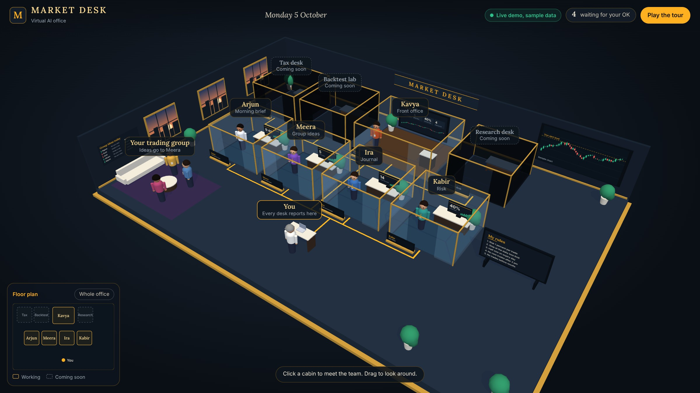
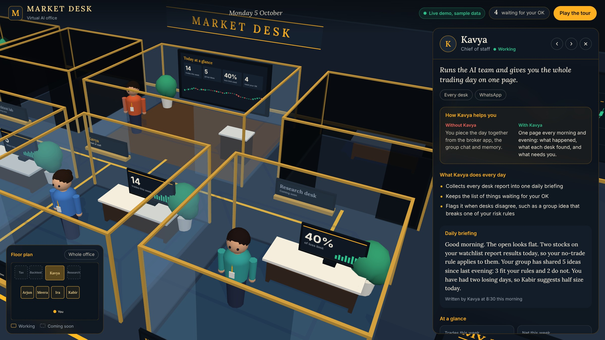
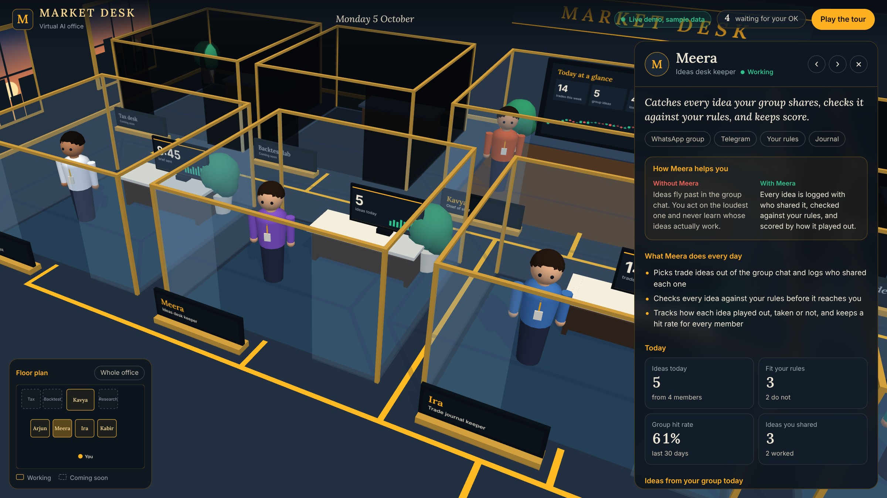
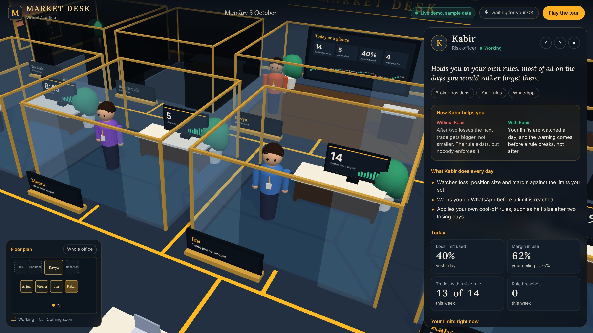

# Market Desk AI Office

A concept demo of a virtual AI office for a solo stock-market trader in India who trades alongside a group that shares ideas. Each glass cabin is an AI staff member that takes one job off the trader's plate.

**Live demo:** https://market-desk-ai-office.vercel.app (add `?name=Your%20Name` to rename the office)



This is a demo with sample data. It gives no buy or sell calls and places no orders. It is not investment advice. Every trading decision stays with the trader.

## A quick tour in pictures

Every number, name and message in these screenshots is sample data.

### 1. The whole floor


Five lit cabins are working desks and the three dark ones are coming soon. The lounge on the left is the trading group. Every amber line on the floor leads back to the trader's own desk at the front. The floor plan in the corner jumps to any cabin.

### 2. Kavya, chief of staff



Every panel opens the same way: "Without Kavya / With Kavya", then what she does each day, then her written briefing for the day.

### 3. Meera, the ideas desk



For a trader whose group shares ideas all day: 5 ideas from 4 members, 3 that fit his own rules, and a 61% hit rate for the group over 30 days.

### 4. Kabir, the risk desk



His own limits, watched all day: how much of the loss limit and margin is used, how many trades stayed inside the size rule, and any breach.

## What each bot does

| Cabin | AI staff | Without it | With it |
| --- | --- | --- | --- |
| Front office | Kavya, chief of staff | Reports scattered across apps and chats | One page, morning and evening, with what happened and what needs an OK |
| Morning brief | Arjun | Reading overnight news and result calendars by hand | A one-minute brief at 8:45, filtered by the trader's own watchlist and rules |
| Group ideas | Meera | Ideas lost in the group chat, no record of who was right | Every idea logged, checked against the trader's rules, with a hit rate per member |
| Journal | Ira | Trades typed into a spreadsheet, usually late | Trades pulled from the broker, with profit and loss by setup |
| Risk | Kabir | Rules remembered only after they are broken | Loss limit, position size and margin checked all day, with a warning before a rule breaks |
| Tax, Backtest, Research | Coming soon | | |

## How it is built

Plain HTML, CSS and JavaScript modules with no dependencies and no build step.

- `site/gl.js` is a small WebGL renderer written for these office demos.
- `site/scene.js` lays out the room: cabins, the trading-group lounge, the trader's own desk and the rules board.
- `site/data.js` holds every desk's sample data, the activity feed and the tour script.
- `site/app.js` renders the floor plan, side panel, approvals and tour.

## Run it

```
npm start
```

This serves `site/` on http://localhost:8767. Any static file server works.

## Hinglish walkthrough video

```
npm install
npm start               # in one terminal
npm run walkthrough     # in another
```

`tools/walk.js` plays a fixed 110 second timeline with a Hinglish caption per step and captures it frame by frame into `tools/wframes/`. The captions are in `captions/`.

The narrated version uses 15 voice clips, one per caption. `voiceover/prep.py` trims silence, caps long pauses and evens out loudness; `voiceover/build.py` places the clips on one track timed to the captions. The clips themselves are not in the repo.
